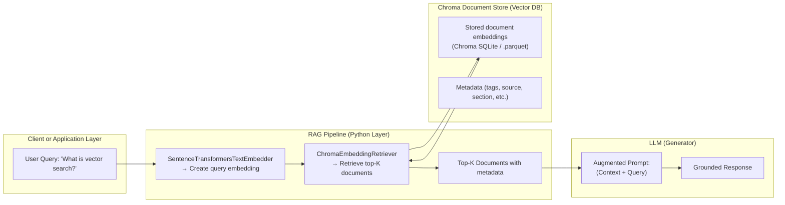

# Quiz-Project

Standalone quiz generator that uses a pre-built Chroma vector store from the sibling RAG-Workflow project.

## Prereqs
- A built vector store at ../.chroma (produced by RAG-Workflow/scripts/rag/vector_store_build.py)
- Ollama for local LLMs (the project is Ollama-only)

## Quick start (Quiz)

Generate a quiz and test your skills. 

```sh
./scripts/bin/run_venv.sh ./master.py prepare
```

Validate against answer key.
```sh
./scripts/bin/run_venv.sh ./master.py validate
```

## Quick start (Chat)

Start an interactive chat that keeps a sliding window of the last N Q/A pairs in memory, augments each turn with vector-store context (RAG), and answers using an Ollama model.

```sh
./scripts/bin/run_venv.sh ./master.py chat
```


## Config
Use these project files:

- params.yaml: the single source of truth for all configuration. Inline comments document every setting and override rule.
- scripts/bin/run_venv.sh: helper to run commands inside the project’s virtual environment.
- master.py: entry point to run workflows: prepare, validate, chat.
- requirements.txt: Python dependencies used by the project.

---


## Diagram: Where ChromaEmbeddingRetriever Fits



---

## In Code Terms

| Component | Class | Responsibility |
|------------|--------|----------------|
| **Embedder** | `SentenceTransformersTextEmbedder` | Converts query → vector |
| **Retriever** | `ChromaEmbeddingRetriever` | Finds similar vectors in Chroma |
| **Vector Store** | `ChromaDocumentStore` | Stores embeddings and metadata |
| **Generator (LLM)** | Ollama model or local LLM | Generates response based on context |

---

## Typical Chroma Stack Setup

When initialized:
```python
self._document_store = ChromaDocumentStore(persist_path=self.cfg.rag_persist)
self._retriever = ChromaEmbeddingRetriever(document_store=self._document_store)
```

- `ChromaDocumentStore` handles **storage** (via SQLite + .parquet).
- `ChromaEmbeddingRetriever` uses **similarity search** APIs to fetch results.
- Together, they implement **dense retrieval** (vector-based) inside your RAG pipeline.

---

## Concept Summary

| Stage | Description |
|-------|--------------|
| 1️⃣ Query Embedding | Encode user text into a high-dimensional vector |
| 2️⃣ Retrieval | `ChromaEmbeddingRetriever` finds nearest neighbors in vector space |
| 3️⃣ Context Assembly | Combine retrieved docs into prompt |
| 4️⃣ Generation | Send context + query to LLM for final answer |