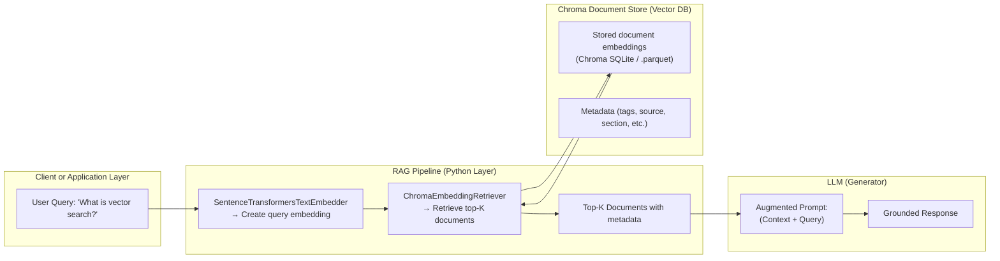

# Quiz-Project

Standalone quiz generator that uses a pre-built Chroma vector store from the sibling RAG-Workflow project.

## Prereqs
- A built vector store at ../.chroma (produced by RAG-Workflow/scripts/rag/vector_store_build.py)
- Ollama for local LLMs (the project is Ollama-only)

## Quick start

1) Create venv and install deps

./scripts/bin/run_venv.sh

2) Generate a quiz (uses ../.chroma by default)

./master.py prepare

3) Validate against answer key (interactive path available)

./master.py validate

## Config
Edit params.yaml to change model, counts, and retrieval settings. The rag_persist path defaults to ../.chroma to reference the vector store in the parent project; change it if you copy this elsewhere.

LLM calls are centralized in scripts/quiz/llm_client.py (Ollama-only). To inspect prompts, payloads, or raw responses, use these flags in params.yaml or on the CLI:
- dump_ollama_prompt: path to write the full prompt
- dump_llm_payload: path to append JSON request payloads
- dump_llm_response: path to append raw provider responses

Retries:
- Transport-level retries for the provider call are controlled by prepare.llm_retries (applies to Ollama POSTs).
- Parsing-level retries for LLM output are controlled by prepare.max_retries; on each retry, the theme varies slightly to diversify outputs.

Prompt templates:
- Templates are used by default and live in scripts/quiz/templates/ (Ollama: ollama_prompt.tmpl).
- Templates use Python's string.Template variables. Available variables include: token, iteration, count, model, theme, recent_clause, corpus, style_clause, and retry_nonce on retries.

Embeddings and Chroma store:
- RAG embeddings are local-only via SentenceTransformers. If your existing ../.chroma store was built with a 768-dim model (common for sentence-transformers/all-mpnet-base-v2), ensure the embedder matches to avoid dimension errors. The default embed model is sentence-transformers/all-mpnet-base-v2.
- You can override via params.yaml under prepare.rag_embed_model or on the CLI with --rag-embed-model.

---


## Diagram: Where ChromaEmbeddingRetriever Fits



---

## In Code Terms

| Component | Class | Responsibility |
|------------|--------|----------------|
| **Embedder** | `SentenceTransformersTextEmbedder` | Converts query → vector |
| **Retriever** | `ChromaEmbeddingRetriever` | Finds similar vectors in Chroma |
| **Vector Store** | `ChromaDocumentStore` | Stores embeddings and metadata |
| **Generator (LLM)** | Ollama model or local LLM | Generates response based on context |

---

## Typical Chroma Stack Setup

When initialized:
```python
self._document_store = ChromaDocumentStore(persist_path=self.cfg.rag_persist)
self._retriever = ChromaEmbeddingRetriever(document_store=self._document_store)
```

- `ChromaDocumentStore` handles **storage** (via SQLite + .parquet).
- `ChromaEmbeddingRetriever` uses **similarity search** APIs to fetch results.
- Together, they implement **dense retrieval** (vector-based) inside your RAG pipeline.

---

## Concept Summary

| Stage | Description |
|-------|--------------|
| 1️⃣ Query Embedding | Encode user text into a high-dimensional vector |
| 2️⃣ Retrieval | `ChromaEmbeddingRetriever` finds nearest neighbors in vector space |
| 3️⃣ Context Assembly | Combine retrieved docs into prompt |
| 4️⃣ Generation | Send context + query to LLM for final answer |
